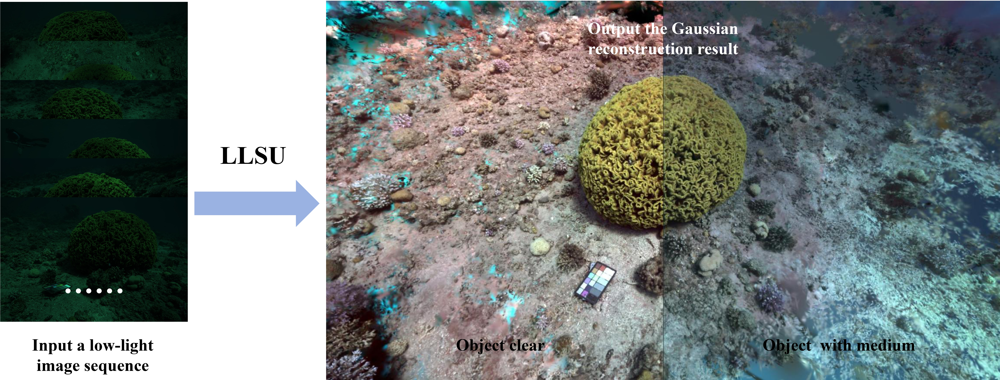
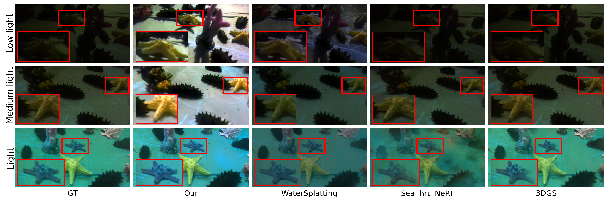
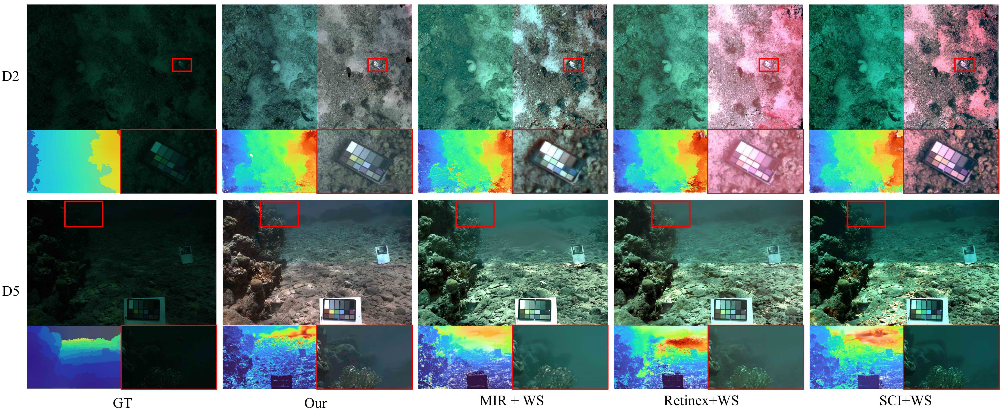
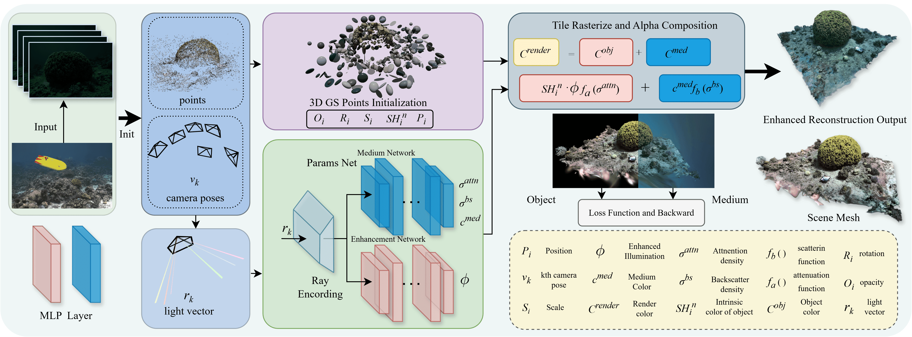

<div align="center">

<h3>Joint Low-Light Enhancement and 3-D Gaussian Splatting<br>for Underwater Visual Sensing</h3>

<p><strong>IEEE Sensors Journal · Volume 26, Issue 19 · 2026</strong></p>
<p>Shaofeng Zou · Kangxu Wang · Huixi Xu · Fengtian Lv · Yuxi Feng · Gang Shao</p>

<p>
  <a href="https://ieeexplore.ieee.org/abstract/document/11663292"></a>
  <a href="https://doi.org/10.1109/JSEN.2026.3724206"></a>
  <a href="https://github.com/booqo/Underwater-Environment-Simulation-Dataset"></a>
</p>

<p>
  <a href="#visual-results">Results</a> ·
  <a href="#method-overview">Method</a> ·
  <a href="#requirements-and-installation">Installation</a> ·
  <a href="#prepare-a-dataset">Data</a> ·
  <a href="#train">Training</a> ·
  <a href="https://github.com/booqo/lowlight-underwater-for-nerf-studio/releases">Releases</a> ·
  <a href="#citation">Citation</a>
</p>


<p><em>From low-light underwater views to enhanced, medium-aware 3D reconstruction.</em></p>

</div>

**LLSU** jointly models scene geometry, underwater image formation, and low-light
enhancement in a 3D Gaussian Splatting pipeline. This repository includes the
Nerfstudio implementation, CUDA rasterizer, and 11 underwater scene configurations.
See our [paper](https://ieeexplore.ieee.org/abstract/document/11663292) for method
details and experimental results.

| Joint enhancement | Underwater rendering | Scene reconstruction |
| :--- | :--- | :--- |
| Learn illumination correction alongside the scene. | Model attenuation and backscatter, with separate object and medium outputs. | Train 3D Gaussians from posed images and inspect novel views in Nerfstudio. |

## Visual results

### Our water-tank dataset

<p align="center">
  <a href=".assets/water-tank-results.png"></a>
</p>

Results on our [water-tank dataset](https://github.com/booqo/Underwater-Environment-Simulation-Dataset).
Rows, top to bottom: **Low light**, **Medium light**, and **Light**.
Left to right: captured reference (`GT`), LLSU (`Our`), WaterSplatting,
SeaThru-NeRF, and 3DGS. LLSU, WaterSplatting, and SeaThru-NeRF show
medium-removed renderings; red boxes mark the enlarged details.

### SeaThru D2 and D5

<p align="center">
  <a href=".assets/qualitative-results.jpg"></a>
</p>

Left to right: captured low-light reference (`GT`),
LLSU (`Our`), MIRNet + WaterSplatting, Retinex + WaterSplatting, and SCI + WaterSplatting.
The renderings compare enhanced views with and without the modeled medium,
alongside depth visualizations and close-ups of scene details.
See the [paper](https://doi.org/10.1109/JSEN.2026.3724206) for the comparison protocol;
[Evaluate](#evaluate) describes the metrics computed by this repository.

## Method overview

1. **Initialize** camera poses and sparse scene points from COLMAP.
2. **Jointly optimize** the Gaussian scene, medium parameters, and illumination correction.
3. **Render** the captured appearance, enhanced appearance, and medium-removed views.

<details>
<summary><strong>View the full method diagram</strong></summary>
<br>
<a href=".assets/pipeline.png"></a>
<p>The medium and enhancement networks predict parameters used by the custom Gaussian renderer.</p>
</details>

---

## Requirements and installation

Use Linux, an NVIDIA GPU, a CUDA toolkit with `nvcc`, and a C++ compiler.
The development environment uses Python 3.11, PyTorch 2.5.1 with CUDA 11.8,
Nerfstudio 1.1.4, and NumPy 1.26.4.

**We recommend an NVIDIA GPU with 24 GB of VRAM**, such as the
[RTX 4090](https://www.nvidia.com/en-us/geforce/graphics-cards/40-series/rtx-4090/)
used in our experiments. In these experiments, GPU memory use was approximately
16 GB at 2212 × 1476 resolution and around 9 GB with 2× downsampling.
For a 16 GB GPU, start with `downscale_factor: 2`. Actual usage depends on image
resolution, scene size, and the number of Gaussians.

```bash
conda create -n llsu python=3.11 -y
conda activate llsu
python -m pip install --upgrade pip
python -m pip install torch==2.5.1 torchvision==0.20.1 --index-url https://download.pytorch.org/whl/cu118
```

Install a compatible CUDA toolkit if necessary, then verify `nvcc --version`.
For the environment above:

```bash
conda install -c nvidia/label/cuda-11.8.0 cuda-toolkit
python -m pip install ninja
python -m pip install 'git+https://github.com/NVlabs/tiny-cuda-nn.git@v1.7#subdirectory=bindings/torch' --no-build-isolation

git clone https://github.com/booqo/lowlight-underwater-for-nerf-studio.git
cd lowlight-underwater-for-nerf-studio
python -m pip install -e .
```

Nerfstudio 1.1.4 is pinned by the package. The bundled CUDA extension compiles
on first use; no separate `cudalight` installation is required. Set
`export MAX_JOBS=2` before installation or the first run to limit compiler RAM use.

Check the environment and method registration:

```bash
python -c 'import torch; print(torch.__version__, torch.version.cuda, torch.cuda.is_available())'
ns-train lowlight_underwater --help
```

Run the following commands from the repository root.

## Prepare a dataset

Provide input images and a matching COLMAP reconstruction with camera poses
and sparse 3D points. Image filenames in COLMAP must match the input directory.
Use either COLMAP binary files or their text equivalents:

```text
datasets/
└── <scene>/
    ├── images/
    │   ├── image_001.png
    │   └── ...
    └── sparse/0/
        ├── cameras.bin
        ├── images.bin
        └── points3D.bin
```

Create `datasets/` in the repository root or symlink it to your dataset storage.
Our underwater tank dataset is available in the
[dataset repository](https://github.com/booqo/Underwater-Environment-Simulation-Dataset).
Obtain other datasets separately under their respective terms.

All supplied scene configurations use the same layout:
`datasets/<scene>/images/` for input images and `datasets/<scene>/sparse/0/`
for the matching COLMAP reconstruction. The scene directory name matches the
configuration filename without `.yaml`.

Available configurations in `lowlight_underwater/configs/`:

| Dataset | Scene configurations |
| --- | --- |
| Underwater tank | `1_my_data_lowlight.yaml`, `2_my_medium_light.yaml`, `3_my_data_light.yaml` |
| SeaThru | `D2_seathru.yaml`, `D3_seathru.yaml`, `D4_seathru.yaml`, `D5_seathru.yaml` |
| SeaThru-NeRF | `4_Curasao.yaml`, `5_IUI3-RedSea.yaml`, `6_JapaneseGradens-RedSea.yaml`, `7_Panama.yaml` |

For `downscale_factor: 2`, Nerfstudio uses `images_2/` containing images resized
to half width and height. It can prompt to generate this folder from `images/`
using FFmpeg (`ffmpeg` must be on `PATH`). Keep `images_path` pointing to `images/`;
the dataparser selects the resized folder according to `downscale_factor`.

## Train

After preparing the low-light tank dataset:

```bash
(cd lowlight_underwater/configs && python ../train.py --config 1_my_data_lowlight.yaml)
```

The default training schedule is 15,000 iterations for both `lowlight_underwater`
and `lowlight_underwater_big`. Scene YAMLs select the method and model settings; see
[`lowlight_underwater_config.py`](lowlight_underwater/lowlight_underwater_config.py).

Runs save `config.yml` and checkpoints under:

```text
outputs/<scene>/unnamed/<method>/<timestamp>/
├── config.yml
└── nerfstudio_models/
    └── step-*.ckpt
```

Keep the configuration and checkpoints together. The viewer can remain open
after training; use Ctrl+C to close it. Record the source commit with your results.

### Use your own scene

Copy a suitable configuration and edit its paths:

```bash
cp lowlight_underwater/configs/1_my_data_lowlight.yaml lowlight_underwater/configs/my_scene.yaml
```

Set `images_path`, `colmap_path`, and `output_dir` for your scene, for example
`../../datasets/my_scene/images`, `../../datasets/my_scene/sparse/0`, and
`../../outputs/my_scene`. Relative paths resolve from the **working directory**,
so keep the same invocation pattern:

```bash
(cd lowlight_underwater/configs && python ../train.py --config my_scene.yaml)
```

To enable enhancement, set both `enhance_enable: true` and `one_color: false`
under `pipeline.model` (the `enhance-enable` spelling is also supported).

## Evaluate

Edit [`eval_configs/example.yaml`](lowlight_underwater/eval_configs/example.yaml):
set `render_load_config` to the **absolute path** of your saved `config.yml`
and `render_output_path` to the destination for evaluation images. Then run:

```bash
(cd lowlight_underwater/eval_configs && python ../eval.py --config example.yaml)
```

Metrics are written to `lowlight_underwater/eval_configs/output.json`; a new
evaluation overwrites that file, so save it with the corresponding run.
The JSON includes checkpoint information and mean/standard-deviation metrics.
Evaluation images are written as PNG files to `render_output_path`.

**PSNR, SSIM, and LPIPS measure reconstruction of the captured appearance** by
comparing `rgb` with the input images on the evaluation split. Evaluating
enhancement against a bright or water-free reference requires aligned reference
images and a separate comparison protocol.

## Render and inspect

Edit [`render_configs/example.yaml`](lowlight_underwater/render_configs/example.yaml)
with your absolute `render_load_config`, desired `render_output_path`, and
`render_split` (`train`, `val`, `test`, or `train+test`):

```bash
(cd lowlight_underwater/render_configs && python ../render.py --config example.yaml)
```

The renderer exports inputs and all outputs as JPEGs under
`<render_output_path>/<split>/<output-name>/`, using source image stems:

| Output | Meaning |
| --- | --- |
| `gt-rgb` | Input image for the selected camera |
| `rgb` / `rgb_lowlight` | Reconstruction of the captured appearance |
| `rgb_enhanced` | Enhanced image retaining the modeled water contribution |
| `rgb_clear` | Clear object rendering without modeled attenuation or backscatter |
| `rgb_clear_enhanced` | Enhanced clear object rendering |
| `depth` | Visualized scene depth |
| `accumulation` | Accumulated opacity |

When enhancement is disabled, `rgb_enhanced` equals `rgb`. This also applies
when `one_color: true`, including the supplied D2 and D3 configurations.
To inspect a checkpoint interactively:

```bash
(cd lowlight_underwater/configs && ns-viewer --load-config /absolute/path/to/config.yml)
```

Use the viewer's output selector to switch between renderings. Launch it from
`lowlight_underwater/configs/` as shown above so that relative data paths resolve
correctly.

## Troubleshooting

- **CUDA compilation fails:** confirm that `nvcc` is available and the toolkit
  matches PyTorch's CUDA build. Set `MAX_JOBS=2` if compilation exhausts host RAM.
- **Out of GPU memory:** start with `downscale_factor: 2` on a 16 GB GPU; increase
  it to `4` for larger scenes if needed. Prepare the corresponding resized images
  as described above. Required memory also grows as training adds Gaussians.
- **Missing images or COLMAP files:** check filenames, capitalization, and working directory.
- **Missing checkpoint:** use the `config.yml` generated by training, retain its
  `nerfstudio_models/` directory, and replace the example's placeholder path.
- **Enhanced and original outputs look identical:** check `enhance_enable` and
  `one_color`; the enhancement path requires the settings described above.

## Code and validation

`lowlight_underwater/` contains the model and method registration. `losses.py`
holds image priors; `rasterizerlight/` and `cudalight/` implement Python/CUDA rendering.

See [CONTRIBUTING.md](CONTRIBUTING.md) for source checks and GPU validation
requirements, and [docs/RELEASING.md](docs/RELEASING.md) for packaging checks and
release validation status.

## Citation

If you use LLSU in your research, please cite the paper:

```bibtex
@article{zou2026llsu,
  author  = {Zou, Shaofeng and Wang, Kangxu and Xu, Huixi and Lv, Fengtian and Feng, Yuxi and Shao, Gang},
  title   = {{LLSU}: Joint Low-Light Enhancement and {3-D} Gaussian Splatting for Underwater Visual Sensing},
  journal = {IEEE Sensors Journal},
  year    = {2026},
  volume  = {26},
  number  = {19},
  pages   = {29234--29248},
  doi     = {10.1109/JSEN.2026.3724206},
  url     = {https://ieeexplore.ieee.org/abstract/document/11663292}
}
```

[IEEE Xplore](https://ieeexplore.ieee.org/abstract/document/11663292) ·
[DOI](https://doi.org/10.1109/JSEN.2026.3724206) ·
[Machine-readable citation](CITATION.cff)

## License and acknowledgements

Original code uses the [MIT license](LICENSE). Nerfstudio- and gsplat-derived code
retains Apache-2.0 notices; GLM retains its license. See [THIRD_PARTY_NOTICES.md](THIRD_PARTY_NOTICES.md).

LLSU builds on [Nerfstudio](https://github.com/nerfstudio-project/nerfstudio),
[gsplat](https://github.com/nerfstudio-project/gsplat),
[WaterSplatting](https://github.com/water-splatting/water-splatting), and
[LLNeRF](https://github.com/onpix/LLNeRF).
